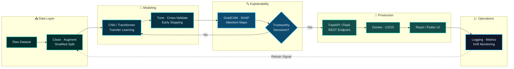

<div align="center">


<br/>

[](https://github.com/Tanvir284)
[](https://github.com/Tanvir284?tab=followers)
[](https://github.com/Tanvir284?tab=repositories)
[](https://github.com/Tanvir284?tab=repositories)


</div>

<br/>

<table>
<tr>
<td width="60%" valign="top">

### `>` whoami

I build **machine learning systems that actually reach users** — not notebooks that
die on a local GPU.

My work sits at the intersection of **deep learning research** and **production
software engineering**: I train the model, wrap it in an API, deploy it behind a
real frontend, and make its decisions *explainable* so a human can trust the output.

Currently focused on **Explainable AI for Computer Vision** — building models that
don't just predict, but **show you why**.

</td>
<td width="40%" valign="top">

```yaml
name:      Md Tanvir Islam
role:      AI/ML + Full-Stack Engineer
location:  Dhaka, Bangladesh 🇧🇩
degree:    B.Sc. CSE — BUBT
focus:     Explainable AI, CV, NLP
languages: Python, C++, Java, JS, Dart
open_to:   ML Engineer · SWE
           Research Assistant
           Remote / Relocation 🌏
status:    ✅ Open to opportunities
```

</td>
</tr>
</table>

<div align="center">

[](mailto:ruhittanvir14@gmail.com)
[](https://www.linkedin.com/in/md-tanvir-islam-3186b3282/)
[](https://tanvir284.github.io/Portfolio/)
[](https://leetcode.com/u/Tanvir_Islam84/)
[](https://codeforces.com/profile/ruhittanvir14)


</div>

## 💼 &nbsp;Experience

<table>
<tr>
<td width="8">&nbsp;</td>
<td>

**IT Officer** — *Highland Agrotourism Limited*, Dhaka &nbsp;&nbsp;`Current`

Owning the company's technical and digital growth stack end-to-end:

- Plan and run **performance marketing campaigns** across Meta (Facebook/Instagram), YouTube and Google Ads — audience targeting, creative testing, budget allocation
- Track campaign performance through analytics dashboards and **iterate on data**, not guesswork
- Manage the company's digital infrastructure, content pipeline and technical operations
- Bridge the gap between **business goals and technical execution**

</td>
</tr>
</table>

<div align="center">

</div>

## 🎯 &nbsp;What I Bring to a Team

<table>
<tr>
<td width="33%" valign="top" align="center">

### 🧠
**Research → Production**

I read the paper, reimplement it in PyTorch, and then do the part most people skip — **ship it**. Flask/FastAPI serving, Docker packaging, a real UI on top.

</td>
<td width="33%" valign="top" align="center">

### 🔍
**Explainability First**

A model that can't justify itself is a liability. I build **GradCAM / SHAP / LIME** into the pipeline so stakeholders can audit predictions — critical for medical & high-stakes domains.

</td>
<td width="33%" valign="top" align="center">

### ⚙️
**Full-Stack Ownership**

Backend, frontend, mobile, database, deployment. I don't hand off at the API boundary — I can take a product from **empty repo to live URL** alone.

</td>
</tr>
<tr>
<td valign="top" align="center">

### 📐
**Algorithmic Depth**

Daily LeetCode & Codeforces practice. Data structures and complexity analysis aren't interview trivia to me — they're why my pipelines don't fall over at scale.

</td>
<td valign="top" align="center">

### 🚀
**Ship Velocity**

45+ public repositories. I learn by building, and I build fast. Ideas get prototyped in days, not quarters.

</td>
<td valign="top" align="center">

### 🌏
**Remote-Ready**

Async communication, clear documentation, clean commit history. Comfortable working across time zones and open to relocation.

</td>
</tr>
</table>

<div align="center">

</div>

## 🛠️ &nbsp;Technical Arsenal

<div align="center">

#### 🤖 &nbsp;AI · Machine Learning · Data Science


<br/>


#### 🌐 &nbsp;Backend · APIs


<br/>


#### 📱 &nbsp;Frontend · Mobile


#### 🗄️ &nbsp;Databases


#### ⚙️ &nbsp;DevOps · Cloud · Tooling


<br/>


#### 💻 &nbsp;Programming Languages


</div>

<div align="center">

</div>

## 🏗️ &nbsp;How I Architect an ML Product

> This is the pipeline I follow on every deep-learning project — from raw data to a monitored, explainable production endpoint.



<div align="center">

</div>

## 🚀 &nbsp;Featured Work

<table>
<tr>
<td width="50%" valign="top">

### 🧠 &nbsp;Medical Image Classifier
`Deep Learning` · `Explainable AI` · `Healthcare`

A CNN-based diagnostic classifier that **shows its reasoning**. GradCAM heatmaps
overlay the exact image regions driving each prediction, so a clinician can verify
the model instead of trusting a black box. Served as a Flask REST API with an
upload-and-diagnose web interface.

`PyTorch` `GradCAM` `OpenCV` `Flask` `NumPy`

</td>
<td width="50%" valign="top">

### 🌐 &nbsp;Tender Management System
`Automation` · `Full-Stack` · `Web Scraping`

An end-to-end platform that **automatically scrapes public tender listings**,
normalizes them into PostgreSQL, and surfaces them on a Django dashboard with
real-time alerts — replacing hours of manual daily searching with a scheduled job.

`Django` `Selenium` `PostgreSQL` `Celery` `Python`

</td>
</tr>
<tr>
<td width="50%" valign="top">

### 🤖 &nbsp;XAI Research Toolkit
`Research Tooling` · `Model Auditing`

An interactive Streamlit workbench for **auditing black-box deep learning models**.
Load a trained network, run GradCAM and SHAP side by side, and compare which
features each method credits — built to answer *"can we actually deploy this?"*

`PyTorch` `SHAP` `Streamlit` `Matplotlib`

</td>
<td width="50%" valign="top">

### 📊 &nbsp;NLP Sentiment Pipeline
`NLP` `Transformers` `Fine-Tuning`

A reproducible pipeline for **fine-tuning transformer models** on custom
multi-class text datasets — tokenization, class-imbalance handling, training loop,
and an evaluation report with confusion matrices and per-class F1.

`HuggingFace` `PyTorch` `Scikit-learn` `Pandas`

</td>
</tr>
<tr>
<td width="50%" valign="top">

### 📱 &nbsp;Flutter Cross-Platform App
`Mobile` · `Realtime` · `Firebase`

A single Dart codebase shipping to **both Android and iOS** — Firebase
authentication, real-time database sync, offline-capable state handling and an
adaptive UI that respects each platform's design language.

`Flutter` `Dart` `Firebase` `Provider`

</td>
<td width="50%" valign="top">

### 🏆 &nbsp;Competitive Programming Archive
`Algorithms` · `Data Structures`

A continuously growing, **categorized solution archive** across LeetCode and
Codeforces — graphs, DP, greedy, number theory — each solution annotated with
its approach and complexity analysis.

`C++` `Python` `Algorithms`

</td>
</tr>
</table>

<div align="center">

[](https://github.com/Tanvir284?tab=repositories)


</div>

## 🧭 &nbsp;Engineering Principles

<table>
<tr>
<td width="8">&nbsp;</td>
<td>

> **`01`** &nbsp;**Reproducibility over cleverness.** &nbsp;Pinned seeds, pinned versions, documented runs. A result that can't be reproduced isn't a result.
>
> **`02`** &nbsp;**Explainability is not optional.** &nbsp;If a model influences a real decision, a human must be able to interrogate it.
>
> **`03`** &nbsp;**Ship the smallest honest version.** &nbsp;A deployed 88% model beats a 94% model that never leaves the notebook.
>
> **`04`** &nbsp;**Read the source, not just the docs.** &nbsp;Understanding the internals is what separates a user of a library from an engineer.
>
> **`05`** &nbsp;**Measure before optimizing.** &nbsp;Profile first. Intuition about bottlenecks is usually wrong.
>
> **`06`** &nbsp;**Write it down.** &nbsp;Clear READMEs, meaningful commits, documented decisions — future teammates included.

</td>
</tr>
</table>

<div align="center">

</div>

## 🎓 &nbsp;Education

<div align="center">

| 🏛️ Institution | 📚 Degree | 📅 Period | 📊 CGPA |
|:---|:---|:---:|:---:|
| **Bangladesh University of Business & Technology (BUBT)** | B.Sc. in Computer Science & Engineering | 2022 – 2025 | **3.36 / 4.00** |

</div>

**Relevant coursework:** Data Structures & Algorithms · Machine Learning · Artificial Intelligence · Digital Image Processing · Database Systems · Operating Systems · Computer Networks · Software Engineering · Object-Oriented Programming

> 🌏 **Graduate Ambition** — Actively pursuing the **MEXT Scholarship (Japan)** 🇯🇵 for an MS/PhD in AI & Machine Learning, with a research focus on **explainable computer vision for medical imaging**.

<div align="center">

</div>

## ⚔️ &nbsp;Competitive Programming

<div align="center">

<a href="https://leetcode.com/u/Tanvir_Islam84/">
  
</a>
&nbsp;
<a href="https://codeforces.com/profile/ruhittanvir14">
  
</a>

<sub>🔥 Daily problem-solving practice — graphs, dynamic programming, greedy, number theory & data structure design.</sub>


</div>

## 📊 &nbsp;GitHub Analytics

<div align="center">


<br/><br/>


<br/>


<br/><br/>


</div>

## 🗺️ &nbsp;2027 Roadmap

<table>
<tr>
<td width="8">&nbsp;</td>
<td>

```text
🔄  IN PROGRESS   Publish a peer-reviewed paper — Explainable CV for medical imaging
🔄  IN PROGRESS   Secure MEXT / fully-funded MS in AI abroad  🇯🇵
🔄  IN PROGRESS   Cross 500+ LeetCode problems & reach Codeforces Specialist
⏳  QUEUED        Land an ML Engineering role at a product-driven company
⏳  QUEUED        Ship 2 production ML products end-to-end (train → serve → monitor)
⏳  QUEUED        Merge contributions into 3+ open-source AI/ML repositories
⏳  QUEUED        Go deep on LLMs — fine-tuning, RAG pipelines, model serving at scale
⏳  QUEUED        Build an MLOps stack: experiment tracking, model registry, drift alerts
```

</td>
</tr>
</table>

<div align="center">

</div>

## 💬 &nbsp;Let's Build Something

<div align="center">

### 🟢 &nbsp;Currently open to ML Engineer, Software Engineer & Research Assistant roles

**Remote · Hybrid · Open to relocation** 🌏

I'm looking for a team where models ship, code gets reviewed, and hard problems are the default.
If that's yours — my inbox is open.

<br/>

[](mailto:ruhittanvir14@gmail.com)
[](https://www.linkedin.com/in/md-tanvir-islam-3186b3282/)
[](https://tanvir284.github.io/Portfolio/)

<br/>


<br/>


<sub>⭐ **If any of my work helped you, a star means a lot — it keeps me building.** ⭐</sub>

</div>
